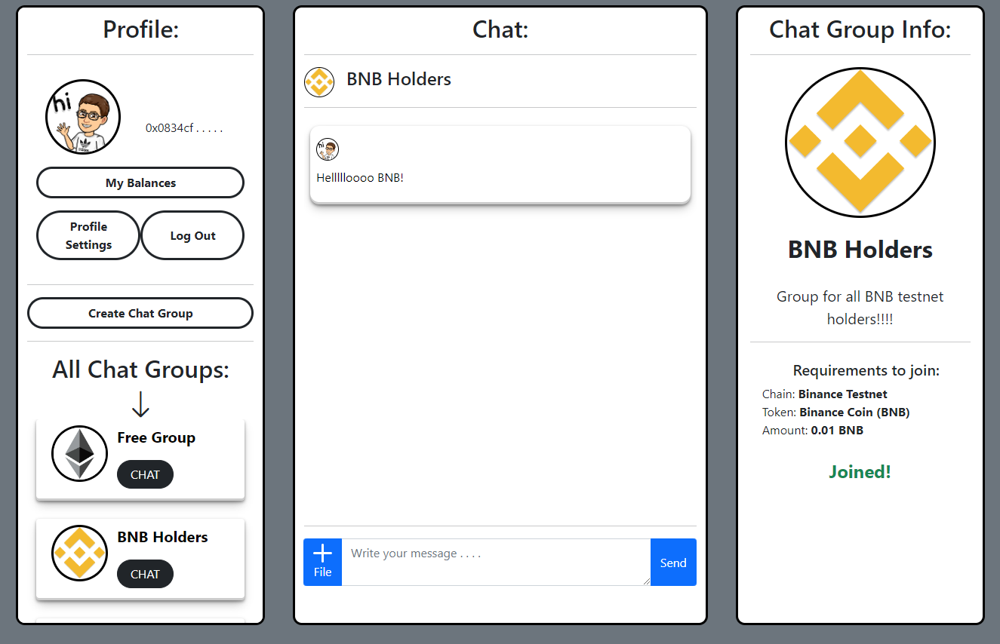

# Simple Chat
Simple Chat is decentralized application, where anyone can create a chat group with some limitations based on user's token balance or NFTs. Anyone can join any chat group as long as they meet its requirements, for example: I can create a chat group for BAYC holders and anyone holding at least 1 BAYC will be able to join and chat. This project was built in a 7-day Moralis programming challenge.

Please leave a ⭐ if you like it.

## Try It Out
If you find any **errors** ⛔, please report them to [cleancode198@gmail.com](mailto:cleancode198@gmail.com) thanks 🙏.

## Technologies
I used [Moralis](https://moralis.io/) for storing messages, groups, users, authentication and their Web3API for getting users' token and NFT balances.

It was built with vanilla JavaScript.

## About Me
Hi! 👋 I'm Jin, passionate **web and blockchain developer**. Take a look at my [portfolio](https://jinkong.netlify.com).

You can get in touch with me through my [website](https://jinkong.netlify.com) or contact me on [linkedin](https://linkedin.com/in/jinkong198).

Do you like my work? You can support me by donating to this address: 0xf18432a6d3C6f8720227C2856dEE97B6d99357EF

## License
[MIT](https://choosealicense.com/licenses/mit/)
